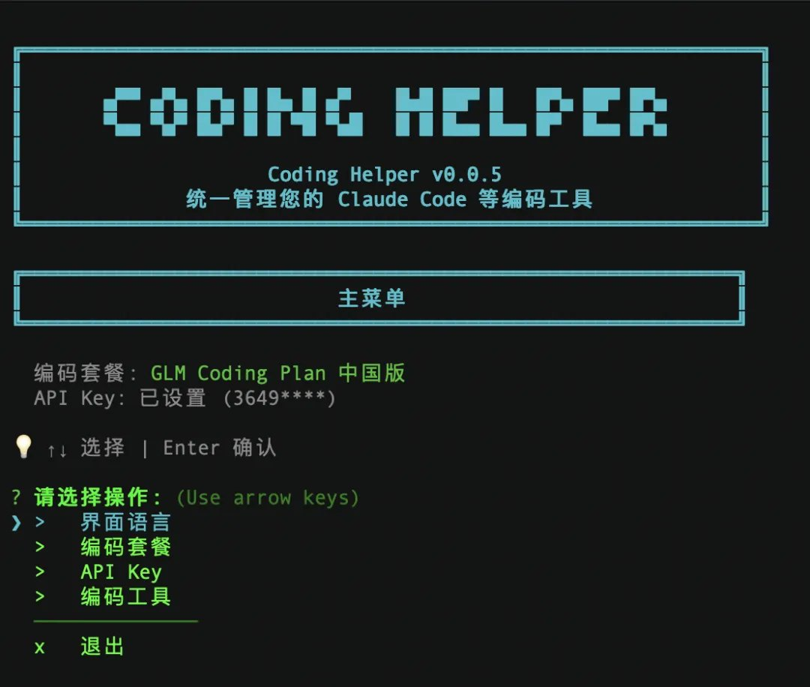
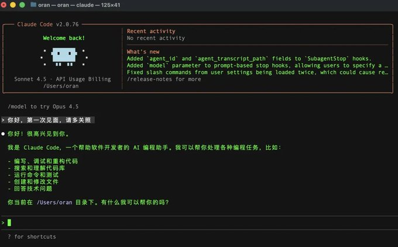
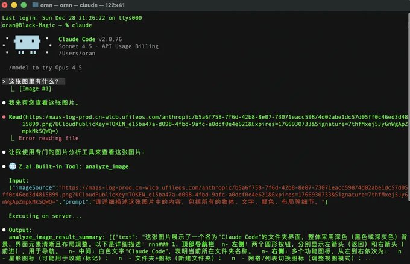
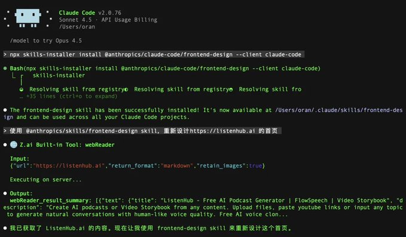

Claude Code入门指南
============

# 引言
Claude Code是我今年最推荐的 AI 产品，没有之一。

Claude Code 虽然叫 Code，但它的功能绝对不止是写代码，而是一款真正意义上的通用 Agent。

很多电脑上的很繁琐的工作，都是 Claude Code 一句话的事情。

我用它做问答、写作、写网页、写软件。

友情提醒，这篇文章比较长，一步一步操作下来，大概需要一个小时。

# 一、基础准备
1. 先准备一个科学的网络环境。
2. 到这里安装最新版本的 Node.js ，地址：
https://nodejs.org/en/download/
3. Windows 用户还需要额外安装 Git for Windows，地址：https://git-scm.com/install/windows

# 二、正式开始安装 Claude Code

1. 在你的电脑上，搜索「终端」，打开它，是这样的，不用害怕，你就把它理解成一个界面很酷的 AI 对话框。

2. 在终端里，粘贴下面的命令，然后回车。
npm install -g @anthropic-ai/claude-code
这里你可能会遇到各种报错，如果你已经安装了其他 AI 编程工具，如 Cursor，强烈建议在这些工具内安装，他们会帮你解决问题。
如果没有其他工具，可以询问任何 AI 来尝试解决错误。

3. 如果2的方法，安装没有成功，可以尝试下列这个方法：
如果你的电脑是 macOS, Linux, WSL，粘贴这条命令，回车
curl -fsSL https://claude.ai/install.sh | bash

如果你的电脑是 Windows，粘贴这条命令，回车
irm https://claude.ai/install.ps1 | iex

安装完成后，输入 claude --version ，如果出现版本号，则代表安装成功。

# 三、购买 Claude Code 服务器的套餐

如果你能搞定官方的订阅，可以使用官方的。

国内对Claude Code模型支持比较好的有三个：GLM 4.7，MiniMax M2.1，Kimi K2。

这里，我们以用 GLM 4.7 的配置为例来演示一下国产，因为是国内网站，使用就比较简单了，其他模型都有 Coding Plan 也都是类似的。
1. 注册账号。访问智谱开放平台（https://open.bigmodel.cn/）   点击右上角的「注册/登录」按钮，按照提示完成账号注册流程。

2. 获取API Key。在个人中心页面，点击 API Keys（https://bigmodel.cn/usercenter/proj-mgmt/apikeys）  创建一个新的API Key，复制下来备用。

3. 订阅一个 Coding 套餐，用了套餐之后，可以尽情使用，再也不用担心账号欠费背刺。
现在有个跨年特惠，强烈推荐这个包季的 Coding Lite，三个月只要 54 块钱，跟不要钱一样。
可以在这里购买：https://www.bigmodel.cn/glm-coding?ic=3CXLALO5QB

# 四、配置 Claude Code 服务器
有了 Coding 套餐之后，就可以配置使用了。
这里要用到一个新的工具，叫 Coding Tool Helper。
用这个工具可以方便地把 GLM 的服务器配置，导入到 Claude Code 里。
1. 再次进入终端，输入下面的命令行，回车
npx 
NPX @z_ai/编码助手@z_ai/coding-helper
2. 这时候你会看到一个亲切的中文界面

3. 你按照这个工具的提示，把在上面拿到的 API Key 粘贴到这里，并且按提示一步一步地走完就可以了。

五、Claude Code 启动！

🎉 恭喜你，你已经安装好了现在最强的AI工具。

还是在终端里，每次只要输入 claude ，然后回车，你就能看到下面的界面了。

从此以后，这就是你的万能的助手。

# 六、Claude Code 的上手技巧
上手 Claude Code，要学习的东西很多。

但是最基础只有三件事，核心是理解 Claude Code 的工作原理。

你可以把 Claude Code 理解成一个能操作系统的代理人，它能看到你的电脑、读取文件、操作文件、分析文件、输出文件。

你和它的沟通方式，就是通过自然对话，不需要你写一行代码。

1. 文件夹
Claude Code启动的时候，需要你给它指定一个文件夹，这个文件夹就是这次任务的上下文。

我非常建议大家建立一个 Claude Code 文件夹，用于各种 Claude Code 的项目。

把文件夹拖拽到Claude Code里，它会自动读取文件夹。

文件也是一样的逻辑，也可以直接拖到Claude Code里，这是第一个非常重要的技巧。

2. Claude.md 文件

Claude.md 文件是 Claude Code 的核心配置文件，是Claude Code的长期记忆。

你也可以理解为这个文件是 Claude Code 的宪法。

Claude Code 每次启动的时候，都会自动加载这个文件，它记录了你要做什么，你给 Claude Code 的一些规则。

你也可以让 Claude Code 来自己创建这个文件，并把你觉得重要的信息告诉它。

3. 危险模式

什么是危险模式？

顾名思义，就是一旦打开，Claude Code可以全自动地操控你的电脑，不需要你的任何确认。

听起来很危险，但是不开的话，每次操作都要确认，非常繁琐，非常影响效率。

你如果用的是 Claude Code Now 作为启动器，我已经自动帮你打开了危险模式。

如果你没用，那可以输入这段代码手动开启

claude --dangerously-skip-permissions

Claude ---dangerously-skip-permissions

但是一旦开启，Claude Code 可能会造成不可挽回的损失，所以一定要指定好文件夹，同时做好备份。

好，三个重要的事情说完了，接下来是一个一个非常实用的技巧：粘贴图片

有了 Claude Code 后，你遇到任何问题都可以直接问它。但是有些问题需要图片，你就需要把图片粘贴到Claude Code里面。

因为Claude Code运行在终端里，所以粘贴命令和系统不太一样，不是cmd+v，而是

Control + V

粘贴之后，Claude Code 就能看到图片了。

# 七、加载 Skill ，封装好的工作流
Skill 是 Claude Code 最近推出的重要功能。

你可以把 Skill 理解成前人已经测试验证好的工作流，你只需要借来用就好了。

你可以直接从现有的 Skill 网站里 copy，也可以让 Claude Code 自己创建，这是官方的 Skill 指南 https://github.com/anthropics/skills

Skill 的具体使用也非常简单，比如今天刚好看到刘小排老师发的前端设计 Skill (刘小排老师是 Claude Code 之神，大家可以关注他的公众号学习更多技巧）

先用一句话安装 Skill

npx skills-installer install @anthropics/claude-code/frontend-design --client claude-code

然后跟Claude Code说：

使用 @anthropics/skills/frontend-design skill，重新设计 https://listenhub.ai 的首页

得到的结果是这样的，非常高级，完全没有 AI 设计网页的默认蓝紫色。

# 最后
到这里，Claude Code的入门差不多就写完了。

上面的步骤只是你开启智能化工作学习的一个开始，未来还有很多东西要学。

万事开头难，这篇文章其实是最难的部分，后续你遇到任何问题，直接问Claude Code，它都能帮你解决。